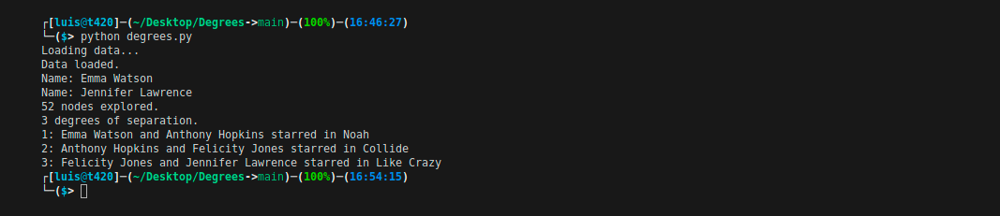

# Degrees

## A program that determines how many “degrees of separation” apart two actors are.

According to the [Six Degrees of Kevin Bacon][kevin] game, anyone in the Hollywood film industry can be connected to Kevin Bacon within six steps, where each step consists of finding a film that two actors both starred in.

In this problem, we’re interested in finding the shortest path between any two actors by choosing a sequence of movies that connects them. For example, the shortest path between Jennifer Lawrence and Tom Hanks is 2: Jennifer Lawrence is connected to Kevin Bacon by both starring in “X-Men: First Class,” and Kevin Bacon is connected to Tom Hanks by both starring in “Apollo 13.”

We can frame this as a search problem: our states are people. Our actions are movies, which take us from one actor to another (it’s true that a movie could take us to multiple different actors, but that’s okay for this problem). Our initial state and goal state are defined by the two people we’re trying to connect. By using breadth-first search, we can find the shortest path from one actor to another.

## Implementation

Inside the `degrees` directory there are two sets of CSV data files: one set in the `large` directory and one set in the `small` directory. Each contains files with the same names, and the same structure, but `small` is a much smaller dataset for ease of testing and experimentation.

Each dataset consists of three CSV files. A CSV file is a way of organizing data in a text-based format: each row corresponds to one data entry, with commas in the row separating the values for that entry.

In `small/people.csv`, each person has a unique `id`, corresponding with their `id` in [IMDb][imdb]’s database. They also have a `name`, and a `birth` year.

Next, in `small/movies.csv`, each movie also has a unique `id`, in addition to a `title` and the `year` in which the movie was released.

Now, `small/stars.csv` establishes a relationship between the people in `people.csv` and the movies in `movies.csv`. Each row is a pair of a `person_id` value and `movie_id` value. The first row (ignoring the header), for example, states that the person with `id` 102 starred in the movie with `id` 104257. Checking that against `people.csv` and `movies.csv`, we’ll find that this line is saying that Kevin Bacon starred in the movie “A Few Good Men.”

Next, in `degrees.py`, at the top, several data structures are defined to store information from the CSV files. The `names` dictionary is a way to look up a person by their name: it maps names to a set of corresponding ids (because it’s possible that multiple actors have the same name). The `people` dictionary maps each person’s id to another dictionary with values for the person’s name, birth year, and the set of all the movies they have starred in. And the movies dictionary maps each movie’s id to another dictionary with values for that movie’s title, release year, and the set of all the movie’s stars. The `load_data` function loads data from the CSV files into these data structures.

The `main` function in this program first loads data into memory (the directory from which the data is loaded can be specified by a command-line argument). Then, the function prompts the user to type in two names. The `person_id_for_name` function retrieves the id for any person (and handles prompting the user to clarify, in the event that multiple people have the same name). The function then calls the `shortest_path` function to compute the shortest path between the two people, and prints out the path.

### Choosing randomly among a page's links, or from any of the pages in the corpus

The `transition_model` returns a dictionary representing the probability distribution over which page a random surfer would visit next, given a corpus of pages, a current page, and a damping factor.

The function accepts three arguments: `corpus`, `page`, and `damping_factor`.

* The `corpus` is a Python dictionary mapping a page name to a set of all pages linked to by that page.

* The `page` is a string representing which page the random surfer is currently on.

* The `damping_factor` is a floating point number representing the damping factor to be used when generating the probabilities.

The return value of the function is a Python dictionary with one key for each page in the corpus. Each key is mapped to a value representing the probability that a random surfer would choose that page next. The values in this returned probability distribution sums to 1.

* With probability `damping_factor`, the random surfer should randomly choose one of the links from page with equal probability.

* With probability `1 - damping_factor`, the random surfer should randomly choose one of all pages in the corpus with equal probability.

For example, if the corpus were `{"1.html": {"2.html", "3.html"}, "2.html": {"3.html"}, "3.html": {"2.html"}}`, the page was `"1.html"`, and the `damping_factor` was 0.85, then the output of `transition_model` is `{"1.html": 0.05, "2.html": 0.475, "3.html": 0.475}`. This is because with probability 0.85, we choose randomly to go from page 1 to either page 2 or page 3 (so each of page 2 or page 3 has probability 0.425 to start), but every page gets an additional 0.05 because with probability 0.15 we choose randomly among all three of the pages.

If page has no outgoing links, then `transition_model` returns a probability distribution that chooses randomly among all pages with equal probability. (In other words, if a page has no links, we can pretend it has links to all pages in the corpus, including itself.)

### Calculating PageRank by sampling pages from a Markov Chain random surfer

The `sample_pagerank` function accepts a corpus of web pages, a damping factor, and a number of samples, and returns an estimated PageRank for each page.

The function accepts three arguments: `corpus`, a `damping_factor`, and `n`.

* The `corpus` is a Python dictionary mapping a page name to a set of all pages linked to by that page.

* The `damping_factor` is a floating point number representing the damping factor to be used by the transition model.

* `n` is an integer representing the number of samples that should be generated to estimate PageRank values.

The return value of the function is a Python dictionary with one key for each page in the corpus. Each key is mapped to a value representing that page’s estimated PageRank (i.e., the proportion of all the samples that corresponded to that page). The values in this dictionary sums to 1.

The first sample is generated by choosing from a page at random.

For each of the remaining samples, the next sample is generated from the previous sample based on the previous sample’s transition model.

* We pass the previous sample into the `transition_model` function, along with the `corpus` and the `damping_factor`, to get the probabilities for the next sample.

* For example, if the transition probabilities are `{"1.html": 0.05, "2.html": 0.475, "3.html": 0.475}`, then 5% of the time the next sample generated is `"1.html"`, 47.5% of the time the next sample generated is `"2.html"`, and 47.5% of the time the next sample generated is `"3.html"`.

The functions in Python’s `random` module are helpful for making decisions pseudorandomly.

We assume that `n` is at least 1.

### Calculating rank values by iteratively applying the PageRank formula

The `iterate_pagerank` function accepts a corpus of web pages and a damping factor, calculates PageRanks based on the iteration formula described above, and returns each page’s PageRank accurate to within 0.001.

The function accepts two arguments: `corpus` and `damping_factor`.

* The `corpus` is a Python dictionary mapping a page name to a set of all pages linked to by that page.

* The `damping_factor` is a floating point number representing the damping factor to be used in the PageRank formula.

The return value of the function is a Python dictionary with one key for each page in the corpus. Each key is mapped to a value representing that page’s PageRank. 

The values in this dictionary sums to 1.

The function begins by assigning each page a rank of `1 / N`, where `N` is the total number of pages in the corpus.

Then, the function repeatedly calculates new rank values based on all of the current rank values, according to the PageRank formula in the “Background” section. (i.e., calculating a page’s PageRank based on the PageRanks of all pages that link to it).

* A page that has no links at all is interpreted as having one link for every page in the corpus (including itself).

This process repeats until no PageRank value changes by more than 0.001 between the current rank values and the new rank values.

## Resources
* [Uncertainty - Lecture 2 - CS50's Introduction to Artificial Intelligence with Python 2020][cs50 lecture]

## Usage

**To rank a corpus of web pages by importance:** 

* Inside the `pagerank` directory: `python pagerank.py [corpus]`

## Credits
[*Luis Sanchez*][linkedin] 2020.

A project from the course [CS50's Introduction to Artificial Intelligence with Python 2020][cs50 ai] from HarvardX.

[kevin]: https://en.wikipedia.org/wiki/Six_Degrees_of_Kevin_Bacon
[imdb]: https://www.imdb.com/
[cs50 lecture]: https://youtu.be/uQmYZTTqDC0?t=5553
[linkedin]: https://www.linkedin.com/in/luis-sanchez-13bb3b189/
[cs50 ai]: https://cs50.harvard.edu/ai/2020/
